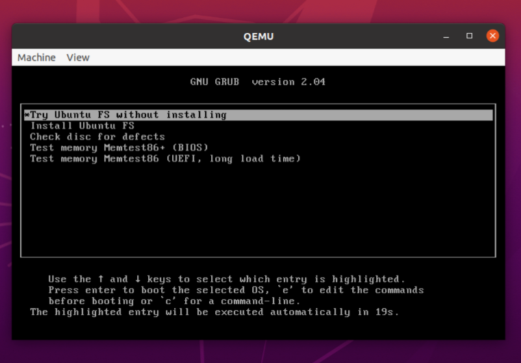

# From Docker to bootable linux image
---------------------

Lets now put the skills outlined in the `README` for creating custom docker images and apply some reverse engineering to walk from a docker image to a bootable linux image.

Assuming you are on ubuntu development platform 

# 1. Extract the docker image filesystem

    docker pull ubuntu:20.04
    ContainerID=$(docker run -d ubuntu:20.04 /bin/true)
    docker export -o ubuntu20.tar ${ContainerID}
    sudo mkdir -p $HOME/ubuntu20/chroot
    sudo sh -c "tar -xf ubuntu20.tar -C $HOME/ubuntu20/chroot"
    rm -f ubuntu20.tar
    
# 2. Mount points

    sudo mount --bind /dev $HOME/ubuntu20/chroot/dev  
    sudo mount --bind /run $HOME/ubuntu20/chroot/run

# 3. Internet access 

We are going to install packages and internet connection is required. You will need to copy these files `stub-resolv.conf` and `resolv.conf` to the chroot environment

    sudo cp /run/systemd/resolve/* $HOME/ubuntu20/chroot/etc

# 4. Access the environment

    sudo chroot $HOME/ubuntu20/chroot

Now that we are inside the environment setup with the filesystem from the docker image `ubuntu:20.04`, 
address the discrepancies between docker containers and linux bootable images or virtual machines.
Setup mount points to help with the installation of missing packages required in ubuntu-live bootable image.
We learned a bit about these discrepancies in the `README`.

A quick recap of the building blocks : Bios -> Bootloader -> Kernel -> Userland

[More on Ubuntu boot process](https://wiki.ubuntu.com/Booting)

# 5. Additional mount points

    mount none -t proc /proc
    mount none -t sysfs /sys
    mount none -t devpts /dev/pts

# 6. Ensure environment variables exist

    export HOME=/root
    export LC_ALL=C
    
# 7. Setup temporary Hostname

    echo "ubuntu20" > /etc/hostname

# 8. Install systemd

    apt-get update && apt-get install -y systemd-sysv
    
You will get a config prompt

    Please select the geographic area in which you live. Subsequent configuration
    questions will narrow this down by presenting a list of cities, representing
    the time zones in which they are located.

      1. Africa      4. Australia  7. Atlantic  10. Pacific  13. Etc
      2. America     5. Arctic     8. Europe    11. SystemV
      3. Antarctica  6. Asia       9. Indian    12. US
    Geographic area: 8

    Please select the city or region corresponding to your time zone.

      1. Amsterdam    17. Guernsey     33. Minsk       49. Sofia
      2. Andorra      18. Helsinki     34. Monaco      50. Stockholm
      3. Astrakhan    19. Isle_of_Man  35. Moscow      51. Tallinn
      4. Athens       20. Istanbul     36. Nicosia     52. Tirane
      5. Belfast      21. Jersey       37. Oslo        53. Tiraspol
      6. Belgrade     22. Kaliningrad  38. Paris       54. Ulyanovsk
      7. Berlin       23. Kiev         39. Podgorica   55. Uzhgorod
      8. Bratislava   24. Kirov        40. Prague      56. Vaduz
      9. Brussels     25. Kyiv         41. Riga        57. Vatican
      10. Bucharest   26. Lisbon       42. Rome        58. Vienna
      11. Budapest    27. Ljubljana    43. Samara      59. Vilnius
      12. Busingen    28. London       44. San_Marino  60. Volgograd
      13. Chisinau    29. Luxembourg   45. Sarajevo    61. Warsaw
      14. Copenhagen  30. Madrid       46. Saratov     62. Zagreb
      15. Dublin      31. Malta        47. Simferopol  63. Zaporozhye
      16. Gibraltar   32. Mariehamn    48. Skopje      64. Zurich
    Time zone: 28

[More on systemd](https://www.freedesktop.org/wiki/Software/systemd/)

# 9. Setup temporary Machine ID

    dbus-uuidgen > /etc/machine-id && ln -fs /etc/machine-id /var/lib/dbus/machine-id

# 10. Setup temporary divert

    dpkg-divert --local --rename --add /sbin/initctl && ln -s /bin/true /sbin/initctl

# 11. Install bootloader(grub) , initramfs-tools (casper) to boot live systems, sudo and others

    apt-get -y upgrade && \
    apt-get install -y \
        sudo \
        ubuntu-standard \
        casper \
        lupin-casper \
        discover \
        laptop-detect \
        os-prober \
        network-manager \
        resolvconf \
        net-tools \
        wireless-tools \
        wpagui \
        locales \
        grub-common \
        grub-gfxpayload-lists \
        grub-pc \
        grub-pc-bin \
        grub2-common
        
 More on:
 
 [Casper](https://manpages.ubuntu.com/manpages/focal/man7/casper.7.html)
 
 [GRUB](https://opensource.com/article/17/3/introduction-grub2-configuration-linux)
 
 # 12. Install the kernel (vmlinuz, initrd)
 
    apt-get install -y --no-install-recommends linux-generic 
 
 Now have a look at the `$HOME/ubuntu20/chroot/boot` folder which was an empty folder in our docker `ubuntu:20.04` image.
 
    # ls boot/
    System.map-5.4.0-126-generic  initrd.img.old
    config-5.4.0-126-generic      vmlinuz
    grub                          vmlinuz-5.4.0-126-generic
    initrd.img                    vmlinuz.old
    initrd.img-5.4.0-126-generic

# 13. Install userland packages (installer, window manager, snapd )

    apt-get install -y \
       ubiquity \
       ubiquity-casper \
       ubiquity-frontend-gtk \
       ubiquity-slideshow-ubuntu \
       ubiquity-ubuntu-artwork \
       plymouth-theme-ubuntu-logo \
       ubuntu-gnome-desktop \
       ubuntu-gnome-wallpapers
 
It will also install non userland tools like memtest86 which is used by the bios.
You will get other Package configuration screens, select as required.
 
You can also install whatever packages you may need.

[More on snapd](https://github.com/snapcore/snapd)

# 14. Remove unused packages

    apt-get autoremove -y

And other unused.

# 15. Other configuration (optional)

    dpkg-reconfigure locales
    dpkg-reconfigure resolvconf
    cat <<EOF > /etc/NetworkManager/NetworkManager.conf
    [main]
    rc-manager=resolvconf
    plugins=ifupdown,keyfile
    dns=dnsmasq

    [ifupdown]
    managed=false
    EOF
    dpkg-reconfigure network-manager

# 16. Cleanup

    truncate -s 0 /etc/machine-id
    rm /sbin/initctl
    dpkg-divert --rename --remove /sbin/initctl
    apt-get clean
    rm -rf /tmp/* ~/.bash_history
    umount /proc
    umount /sys
    umount /dev/pts
    export HISTSIZE=0

* You will need to take extra care of deprovisioning the environment of any sensitive data if this is for production.

# 17. Exit environment

    exit
    sudo umount $HOME/ubuntu20/chroot/dev
    sudo umount $HOME/ubuntu20/chroot/run
    
* Some devices may still be in busy state

You can now see how far we are from the initial `ubuntu:20.04` docker image size of 72.8MB

    sudo du -sh $HOME/ubuntu20/chroot
    
    4.1G	/home/*****/ubuntu20/chroot
    
The main discrepancies between a docker image and linux-live image are almost done with the steps above.
Now lets concentrate on the initial boot process i.e creating a bootable image.

# 1. Prerequisites

If you are familiar with the filesystem of ubuntu-live bootable image you will know the folders `casper, isolinux, install and others`

    cd $HOME/ubuntu20
    sudo mkdir -p image/{casper,isolinux,install}

# 2. Kernel

    sudo cp chroot/boot/vmlinuz-**-**-generic image/casper/vmlinuz
    sudo cp chroot/boot/initrd.img-**-**-generic image/casper/initrd

# 3. BIOS Memory Test

    sudo cp chroot/boot/memtest86+.bin image/install/memtest86+

# 4. UEFI Memory Test

    sudo wget --progress=dot https://www.memtest86.com/downloads/memtest86-usb.zip -O image/install/memtest86-usb.zip && \
    sudo sh -c "unzip -p image/install/memtest86-usb.zip memtest86-usb.img > image/install/memtest86" && \
    sudo rm -f image/install/memtest86-usb.zip

# 5. GRUB Bootloader menu items

    sudo touch image/ubuntu && \
    sudo sh -c 'cat <<EOF > image/isolinux/grub.cfg

    search --set=root --file /ubuntu

    insmod all_video

    set default="0"
    set timeout=30

    menuentry "Try Ubuntu20 without installing" {
       linux /casper/vmlinuz boot=casper nopersistent toram quiet splash ---
       initrd /casper/initrd
    }

    menuentry "Install Ubuntu20" {
       linux /casper/vmlinuz boot=casper only-ubiquity quiet splash ---
       initrd /casper/initrd
    }

    menuentry "Check disc for errors" {
       linux /casper/vmlinuz boot=casper integrity-check quiet splash ---
       initrd /casper/initrd
    }

    menuentry "Test memory Memtest86+ (BIOS)" {
       linux16 /install/memtest86+
    }

    menuentry "Test memory Memtest86 (UEFI, it may take a while)" {
       insmod part_gpt
       insmod search_fs_uuid
       insmod chain
       loopback loop /install/memtest86
       chainloader (loop,gpt1)/efi/boot/BOOTX64.efi
    }
    EOF'

# 6. Manifest of packages

    sudo chroot chroot dpkg-query -W --showformat='${Package} ${Version}\n' | sudo tee image/casper/filesystem.manifest && \
    sudo cp -v image/casper/filesystem.manifest image/casper/filesystem.manifest-desktop && \
    sudo sed -i '/ubiquity/d' image/casper/filesystem.manifest-desktop && \
    sudo sed -i '/casper/d' image/casper/filesystem.manifest-desktop && \
    sudo sed -i '/discover/d' image/casper/filesystem.manifest-desktop && \
    sudo sed -i '/laptop-detect/d' image/casper/filesystem.manifest-desktop && \
    sudo sed -i '/os-prober/d' image/casper/filesystem.manifest-desktop

The output is found here: `image/casper/filesystem.manifest` if you want to go through the list of packages.

# 7. Compress the filesystem

    sudo mksquashfs chroot image/casper/filesystem.squashfs && \
    sudo sh -c "printf $(sudo du -sx --block-size=1 chroot | cut -f1) > image/casper/filesystem.size"

From above we know it is 4.1GB.

    Parallel mksquashfs: Using 4 processors
    Creating 4.0 filesystem on image/casper/filesystem.squashfs, block size 131072.
    [========================================================- ] 117104/117120  99%
    Unrecognised xattr prefix system.posix_acl_access

    Unrecognised xattr prefix system.posix_acl_default
    [=========================================================\] 117120/117120 100%

    Exportable Squashfs 4.0 filesystem, gzip compressed, data block size 131072
        compressed data, compressed metadata, compressed fragments,
        compressed xattrs, compressed ids
        duplicates are removed
    Filesystem size 1500702.45 Kbytes (1465.53 Mbytes)
        37.98% of uncompressed filesystem size (3951517.65 Kbytes)

# 8. GRUB UEFI boot image

    cd $HOME/ubuntu20/image
    sudo grub-mkstandalone \
       --format=x86_64-efi \
       --output=isolinux/bootx64.efi \
       --locales="" \
       --fonts="" \
       "boot/grub/grub.cfg=isolinux/grub.cfg"

# 9. FAT16 boot image

    (
       sudo sh -c "cd isolinux && \
       dd if=/dev/zero of=efiboot.img bs=1M count=10 && \
       mkfs.vfat efiboot.img && \
       LC_CTYPE=C mmd -i efiboot.img efi efi/boot && \
       LC_CTYPE=C mcopy -i efiboot.img ./bootx64.efi ::efi/boot/"
    )

# 10. BIOS boot image

    sudo grub-mkstandalone \
       --format=i386-pc \
       --output=isolinux/core.img \
       --install-modules="linux16 linux normal iso9660 biosdisk memdisk search tar ls" \
       --modules="linux16 linux normal iso9660 biosdisk search" \
       --locales="" \
       --fonts="" \
       "boot/grub/grub.cfg=isolinux/grub.cfg" && \
    sudo sh -c "cat /usr/lib/grub/i386-pc/cdboot.img isolinux/core.img > isolinux/bios.img
    " && \
    sudo /bin/bash -c "(find . -type f -print0 | xargs -0 md5sum | grep -v -e 'md5sum.txt' -e 'bios.img' -e 'efiboot.img' > md5sum.txt)"

# 11. ISO bootable image

    sudo xorriso \
       -as mkisofs \
       -iso-level 3 \
       -full-iso9660-filenames \
       -volid "Ubuntu20_04" \
       -output "../ubuntu20.iso" \
       -eltorito-boot boot/grub/bios.img \
          -no-emul-boot \
          -boot-load-size 4 \
          -boot-info-table \
          --eltorito-catalog boot/grub/boot.cat \
          --grub2-boot-info \
          --grub2-mbr /usr/lib/grub/i386-pc/boot_hybrid.img \
       -eltorito-alt-boot \
          -e EFI/efiboot.img \
          -no-emul-boot \
       -append_partition 2 0xef isolinux/efiboot.img \
       -m "isolinux/efiboot.img" \
       -m "isolinux/bios.img" \
       -graft-points \
          "/EFI/efiboot.img=isolinux/efiboot.img" \
          "/boot/grub/bios.img=isolinux/bios.img" \
          "."
 # 12. USB bootable image
 
    cd $HOME/ubuntu20
    sudo dd if=ubuntu20.iso of=/dev/sdc1 status=progress oflag=sync
 
* Presuming your usb flash drive is on `/dev/sdc1`. Verify with `df` or other commands.

# 13. Test bootable image

We will use `Qemu` to test the `ISO` image. First install it with this command for amd64 platform

    sudo apt-get install -y qemu-system-x86-64
    
Then run this if the image is still in the folder from the steps above

    cd $HOME/ubuntu20 && \
    qemu-system-x86_64 -boot d -cdrom ubuntu20.iso -m 2048

* You can choose your own memory size `-m 2048`

# Ubuntu virtual machine for Azure

You can now apply these skills to create an image to boot a virtual machine.
For our specific ubuntu focal example you could start by downloading the Azure's image:

- [ubuntu-20.04-server-cloudimg-amd64-azure.vhd.tar.gz](https://cloud-images.ubuntu.com/releases/focal/release/ubuntu-20.04-server-cloudimg-amd64-azure.vhd.tar.gz)

- [ubuntu-20.04-server-cloudimg-amd64-azure.vhd.manifest](https://cloud-images.ubuntu.com/releases/focal/release/ubuntu-20.04-server-cloudimg-amd64-azure.vhd.manifest)

- [Azure images](https://cloud-images.ubuntu.com/releases/focal/release/)

And move the contents to an empty `$HOME/ubuntu20/chroot` directory.
Then access the environment following the steps above.
Do not modify the configuration detailed in the links below as they are vital for using the image with Azure.

- [Azure VHDs](https://learn.microsoft.com/en-us/azure/virtual-machines/linux/create-upload-ubuntu)

- [Upload a VHD to Azure](https://learn.microsoft.com/en-us/azure/virtual-machines/linux/disks-upload-vhd-to-managed-disk-cli)

# Conclusion

We have walked back from docker image to a bootable ubuntu-live image. 
We learned how to create our custom docker images in the `README` and also challenged `Docker's Best practices`. 
You may wonder why would you take a docker image and restore it to a bootable linux image? 
There are use cases you will want to do so.
This will be the next topic which is on `Software Development & Security Standards` such as DO-178C and its supplements. The issue is `traceability` which such standards make it a `requirement`.
It is also the main reason I started the `README` with the claim that if you have more than one `FROM` in your `Dockerfile`, you have a problem.
